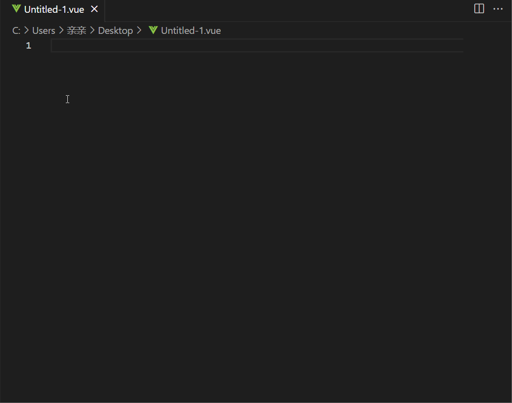

EN:
Version 0.0.1 - Template for Vue 3 components using `veo` command

Features:
- Generate templates for Vue 3 components using the `veo` command.

Version 2.0.1 - Templates for Vue 2 and 3 components using `veo2` and `veo3` commands

Features:
- Add the `veo3` command to generate templates for Vue 3 components.
- Rename the `veo` command to `veo2` for generating templates for Vue 2 components.

中文：

版本0.0.1 - 使用`veo`命令生成Vue 3组件模板

特性：
- 使用`veo`命令生成Vue 3组件模板。

版本2.0.1 - 使用`veo2`和`veo3`命令生成Vue 2和3组件模板

特性：
- 添加`veo3`命令以生成Vue 3组件模板。
- 将`veo`命令重命名为`veo2`以生成Vue 2组件模板。
